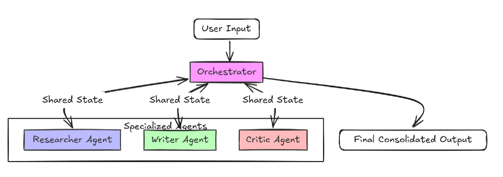

# Multi-Agent Conversational System

A modular, state-managed AI team designed to collaborate on complex content creation tasks. This system leverages the Google Gemini 2.5/3 API to orchestrate specialized agents through a sequential workflow.

##  System Architecture

This project implements a **Sequential Orchestration** pattern with a **Shared State** mechanism. 

### Core Components:
- **Orchestrator:** The central brain of the system. It initializes the agents, manages the transition of data from one stage to the next, and maintains the `state` dictionary that persists throughout the session.
- **Shared State:** A Python dictionary that stores the output of each agent, ensuring the "Writer" knows what the "Researcher" found, and the "Critic" knows what the "Writer" wrote.

### Agent Roles:
1. **Researcher (The Technical Fact-Finder):** - **Task:** Identifies 3-5 specific, high-impact technical facts about the user's topic.
   - **Goal:** Ensure the foundation of the content is grounded in data and technical accuracy.
2. **Writer (The Professional Blogger):** - **Task:** Synthesizes the researcher's findings into a cohesive, engaging narrative.
   - **Goal:** Create a polished draft that balances information with readability.
3. **Critic (The Quality Assurance Editor):** - **Task:** Reviews the draft for tone, flow, and conciseness.
   - **Goal:** Provide a suggested improvement and a final, "production-ready" version of the text.

---

##  Setup & Installation

### Prerequisites:
- Python 3.10+
- A Google Gemini API Key

### Installation:
1. **Clone the Repository:**
   ```bash
   git clone [https://github.com/Harshitha-teki/Build-a-Multi-Agent-Conversational-System]

2. **Set up a Virtual Environment:**
python -m venv venv
# Windows
.\venv\Scripts\activate
# macOS/Linux
source venv/bin/activate

3. **Install Dependencies:**
pip install -r requirements.txt

4. **Environment Configuration:**
Create a .env file in the root directory and add your API key:

GEMINI_API_KEY=your_actual_key_here

Note: If you have issues with .env files on your local system, you can set it directly in your PowerShell session: 
    $env:GEMINI_API_KEY = "your_actual_key_here"


**To run the main interactive system:**
 python main.py

Example Prompt:
When prompted for a topic, try: The Impact of 6G Technology

**System Architecture**



**End-to-End Example Script:**
A dedicated script for the required submission task is provided in example.py. This script runs a pre-defined task: "Write a brief blog post about the benefits of multi-agent AI systems."

**run**
python example.py